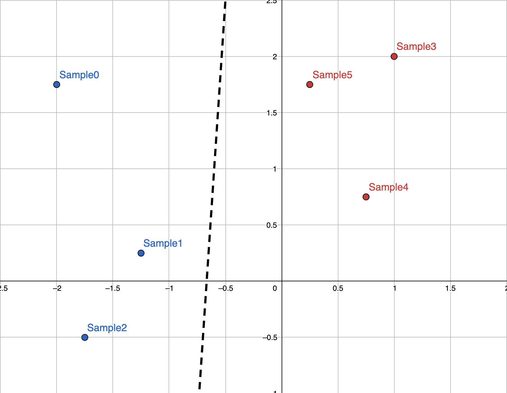
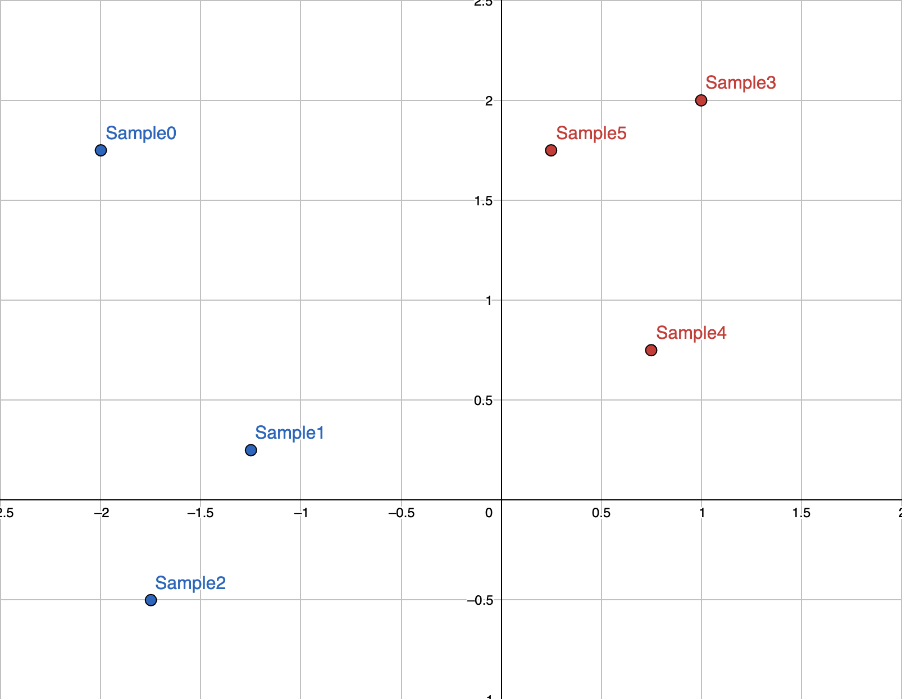

# perceptron

This is a mini-project in which I create a perceptron from scratch in C++. The
perceptron learns using the perceptron learning rule.

# What is a perceptron?

In very simple terms, a perceptron is a binary classifier that takes a vector
input and outputs a 0 or a 1.

# How does a perceptron work?

## Parts of a perceptron

A perceptron has 2 tunable parameters:

- A vector of **weights**

- A **bias**

## Classifying an input

Given an input (assuming the input shape matches the shape of the perceptron's
weights), classification is performed as follows:

1. Calculate the dot product of the perceptron's weights and the input vector.

2. Add the perceptron's bias to the dot product.

Finally, classify the point as 1 if the total sum is positive. Otherwise,
classify it as a 0.

## Initialization

Before a perceptron is "trained" to classify your data well, it must first be
given some set of weights and some bias. During the
[learning process](#learning-process) (below), these weights and this bias will
be altered.

Given enough time and a **linearly separable (!)** dataset, a perceptron will
always converge, no matter what its starting weights were. In this program,
we'll initialize `weights` to `{1, 1, ..., 1}` and `bias` to `0`.

## Learning process

Learning consists of repeating an identical process a total of `n` times where
`n` is the number of *epochs*. Learning also requires a *learning rate*, `lr`,
which specifies how sloppily-but-quickly or carefully-but-slowly our perceptron
arrives at an ideal `weights` and `bias`.

At each *epoch*, the following adjustments are made for each sample (simplified):

1. If the sample is currently being classified correctly, change no weights.

2. Otherwise,

    2.1. If the sample is of type `0` but is being classified `1`, increase
    the weights.

    2.2. If the sample is of type `1` but is being classified `0`, decrease
    the weights.

# Example usage
First, the program asks us how many samples (points) we would like to define, as well as their dimensionality.
To make this example easy to visualize, let's use 2-dimensional points.

```
How many samples? 6
How many dimensions? 2
```

The program then asks for the locations of our points. Let's use these as our samples:

*Note, `x_0` corresponds to the x-axis, `x_1` corresponds to the y-axis.*

The program also needs to know if the sample is **blue** or **red**. Let's set
the `is_type_A` value of a sample to `1` if it's blue, otherwise `0` (meaning
red).
```
Sample 0
x_0? -2
x_1? 1.75
is_type_A? 1  
...
Sample 5
x_0? 0.25
x_1? 1.75
is_type_A? 0
```
At this point, the perceptron is ready to train. The program asks for a 
learning rate and a number of epochs. 
(Refer to [How does a perceptron work?](#how-does-a-perceptron-work) above.)
```
What is the learning rate? 0.1
How many epochs? 200
```
That's it! The perceptron quickly trains on the small dataset. The program
displays the parameters of the perceptron before and after training.
```
Before training: Perceptron(weights: {1.00, 1.00}, bias: 0.00, lr: 0.10)
>After training: Perceptron(weights: {-0.30, 0.02}, bias: -0.20, lr: 0.10)
```
Using the tuned parameters we can plot the line that our perceptron has created
to separate the data. Recall that a `weights` of `{-0.3, 0.02}` and a `bias` of 
`-0.2` means the perceptron classifies a given point `(a, b)` based on 
`-0.3*a + 0.02*b - 0.2 > 0`.

We can generalize this to `x` and `y`, giving us the inequality for a line.
All points above the line will be classified as **blue**, and those below it
will be classified as **red**. As you can see, the parameters of the trained
perceptron have create very good separating line for the data:



Finally, the program shows how much of the training data is now successfully classified by the perceptron.
```
Predicted 1 for Sample({-2.00, 1.75}, is_type_A: 1) ✓
Predicted 1 for Sample({-1.25, 0.25}, is_type_A: 1) ✓
Predicted 1 for Sample({-1.75, -0.50}, is_type_A: 1) ✓
Predicted 0 for Sample({1.00, 2.00}, is_type_A: 0) ✓
Predicted 0 for Sample({0.75, 0.75}, is_type_A: 0) ✓
Predicted 0 for Sample({0.25, 1.75}, is_type_A: 0) ✓
```
